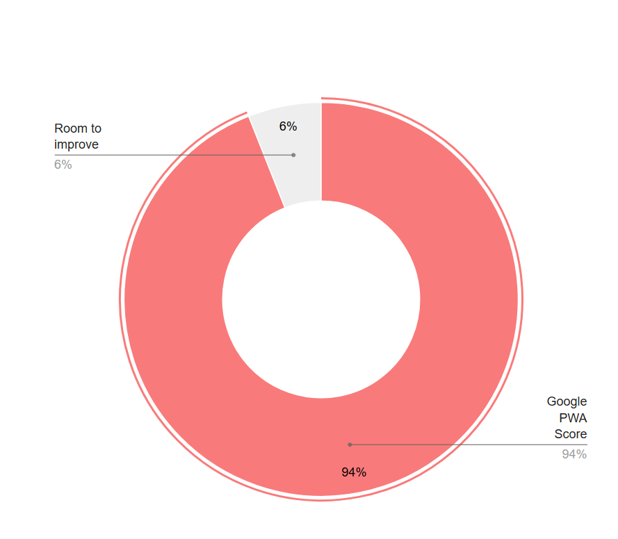

# ✈️ FlyAway — Flight Booking & Management PWA

A modern **Flight Booking & Management Platform** built with **Next.js 15, TypeScript, Tailwind CSS, Zustand, Supabase, and PWA support**.

The application enables users to search flights, select seats with live updates, manage bookings, reschedule/cancel tickets, and use the app as an installable Progressive Web App (PWA).

---

## Live Demo

**Deployed App:**  
https://fly-away-lime.vercel.app/

**Test Credentials:**
email: admin@test.com
password:123456

## Tech Stack

**Frontend**
Next.js 15 (App Router)
React
TypeScript
Tailwind CSS
Zustand (Persist Middleware)

**Backend / Database**
Supabase
Authentication
PostgreSQL Database
Realtime subscriptions
Row Level Security (RLS)
RPC Functions

## Run Locally:

git clone https://github.com/srijangdas/FlyAway.git
cd fly-away
npm i

(Edit .envexample.local with your supabase keys and rename to .env.local)

## Congig Supabase:

npx supabase init
npx supabase login
npx supabase link --project-ref your-project-reference-id
npx supabase db query --linked < supabase/seed.sql

## Run Project:

npm run dev
npm run build
npm start

# Features Implemented

## Task 01 — Flight Search & Booking

- Search flights by origin, destination, date, and passengers
- Dynamic flight listing with pricing and cabin details
- Passenger details collection (name, passport, nationality)
- Booking confirmation with PNR, seat assignment, and fare
- Secure seat validation using Supabase RPC (`lock_seat`)

## Task 02 — Interactive Seat Selection

- Dynamic cabin seat map (First, Business, Economy)
- Color-coded seat availability
- Realtime seat updates using Supabase Realtime
- Occupied seat tooltips with class and extra fee
- Fully responsive and mobile-friendly seat selection

## Task 03 — Rescheduling & Cancellation

- My Bookings page with booking status badges
- Reschedule flights with seat reselection
- Automatic fare difference calculation
- Secure booking cancellation with atomic seat release
- Database-level restriction for cancellation within 2 hours

## Task 04 — Zustand State Management

- Persistent booking flow with Zustand + Persist
- Resume booking after refresh/tab close
- Sensitive passenger data excluded from local storage
- Optimistic seat selection and reset actions

## Task 05 — PWA Support (Bonus)

- Installable Progressive Web App
- Offline fallback support
- Cached flight results and static assets
- Mobile install prompt

# PWA Score:

**94%**

# Zustand Store Structure

The project uses Zustand for lightweight global state management.

useFlightStore

Handles the flight booking flow.

## Stores:

Active search query
Selected flight
Selected seat(s)
Current booking step
Passenger form data
Persistence:

## Uses Zustand Persist middleware to:

Resume booking after refresh
Restore in-progress booking state
Security:

## Sensitive fields such as:

passport number
are excluded from local storage using:

partialize()

to avoid persisting private user data.

useUserStore

Handles authenticated user state.

## Stores:

Supabase session token
Cached booking data
Persistence:

Only session-related information is persisted.

Large or sensitive user data is intentionally excluded.

Store Reset Actions

## Automatic reset actions are triggered on:

User logout
Booking cancellation

to avoid stale booking data and maintain clean application state.
